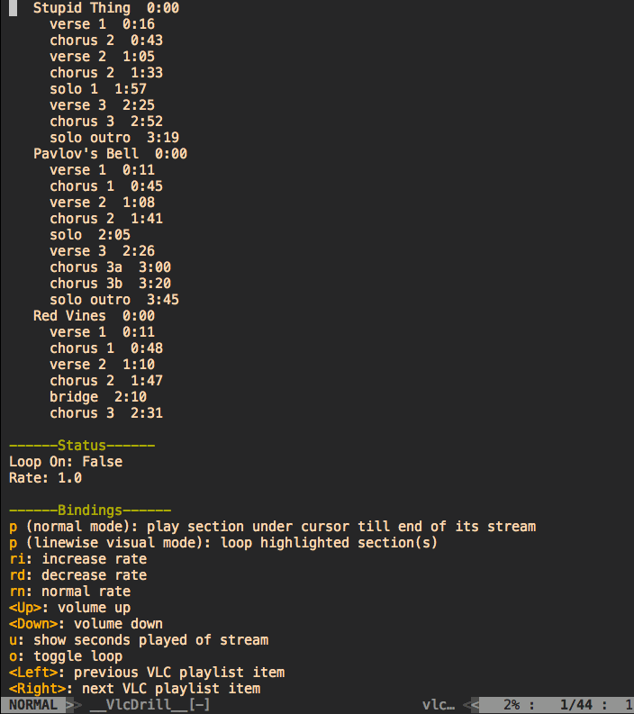

# VLC Drill

Vim interface for controlling VLC over telnet using the `rc` interface.



## Installation

### Pathogen

    cd ~/.vim/bundle
    git clone git://github.com/xdl/vlcdrill.git

And then `:call pathogen#helptags()` to generate the helptags.

## Annotation Format

This is a valid annotation file:

```javascript
{
  "playlist": [{
    "title": "Stupid Thing",
    "stream": "https://www.youtube.com/watch?v=sTm7aZE6u6w",
    "sections": [
      [16, "verse 1"],
      [43, "chorus 2"],
      [65, "verse 2"],
      [93, "chorus 2"],
      117,
      145,
      172,
      199
    ]
  }, {
    "title": "Stupid Thing",
    "stream": "https://www.youtube.com/watch?v=sTm7aZE6u6w",
  }, {
    "stream": "https://www.youtube.com/watch?v=sTm7aZE6u6w"
  },
    "https://www.youtube.com/watch?v=sTm7aZE6u6w"
  ]
}
```

The format is generally:

```javascript
  {
    "playlist": [
      <Stream>...
    ]
  }
```

Where `<Stream>` can be:

* `stream <string>` containing the path for the local file or stream location of the song
* `{stream <string>, title <string>?, section <Section>?}` 

Where `<Section>` can be:

* `start_time <int>`, containing the start time of the section
* `[start_time <int>, description <string>]`

See the `example_annotations/` directory for more examples (The `aimee_mann_youtube.json` is loaded by default, if one isn't set in `g:vlcdrill#annotation#path`)

## Bindings

* `<Up>`: volume up
* `<Down>`: volume down
* `<Space>`: toggle play/pause
* `<Left>`: previous VLC playlist item in selection
* `<Right>`: next VLC playlist item in selection
* `p` (normal mode): play section under cursor till end of its stream
* `p` (linewise visual mode): play and loop highlighted section(s)
* `ri`: increase rate
* `rd`: decrease rate
* `rn`: normal rate
* `u`: show seconds played of stream
* `o`: toggle loop
* `q`: close VlcDrill buffer

## Customisation

Bindings and vlc/annotation paths can be customised in your `vimrc`:

    let g:vlcdrill#bin#path = '/Applications/VLC.app/Contents/MacOS/VLC' "defaults to 'vlc'
    let g:vlcdrill#annotation#path = '/path/to/your/annotation.json'
    nnoremap <leader>vds :VlcDrillShow<CR>
    nnoremap <leader>vdl :VlcDrillLoadAnnotation<CR>

## Compatibility

Have tested it on MacOS and Ubuntu for Vim 7.4.x and 8. Unlikely to work on Windows because of the unix commands that are used.
