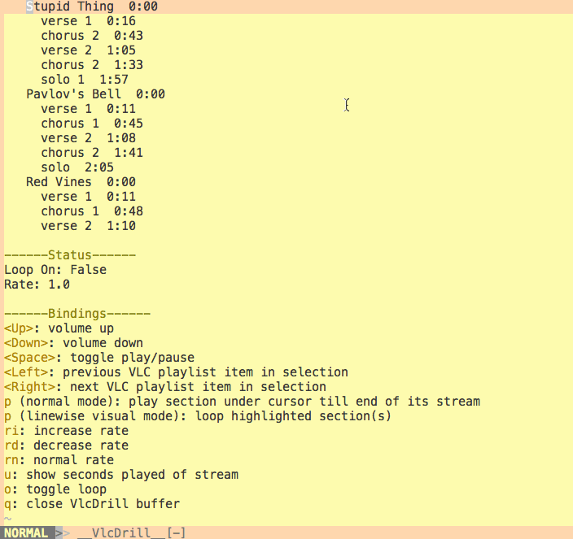

# VLC Drill

Vim interface for controlling VLC over telnet using the `rc` interface.

NOTE: This plugin is now unmaintained.

## Background

When learning how to play a song by ear, it's useful have sections of it on repeat and/or slowed down. It can be fiddly to keep scrubbing back or to set up a loop for a certain passage, so I hacked together some tooling around VLC as a plugin for my text editor that helps.



After 'annotating' the song (i.e. noting down when the verses, choruses, solos etc. starts), the section(s) of interest can then be visually selected and looped over with a few keystrokes. The annotation lives in a text file that can be edited and reloaded in the same session, and I've found that taking notes and controlling the song playback through one program pretty neat. At a pinch, it also comes in handy for ad-hoc YouTube playlists.

## Installation

### Requirements

VlcDrill has been tested it on MacOS (El Capitan → High Sierra), Ubuntu (14.04, 16.04) with VLC 3.0.3. Should work on most unix-y systems with the following commands available in `PATH`:

* `echo`
* `lsof`
* `nc`
* `youtube-dl` (optional)

Vim 8 is needed for some of the newer Vimscript functions (e.g. `closure` and `json_decode`).

### Pathogen

    cd ~/.vim/bundle
    git clone git://github.com/xdl/vlcdrill.git

And then `:call pathogen#helptags()` to generate the helptags.

## Annotation Format

This is a valid annotation file:

```javascript
{
  "playlist": [{
    "title": "Stupid Thing",
    "stream": "https://www.youtube.com/watch?v=sTm7aZE6u6w",
    "sections": [
      [16, "verse 1"],
      [43, "chorus 2"],
      [65, "verse 2"],
      [93, "chorus 2"],
      117,
      145,
      172,
      199
    ]
  }, {
    "title": "Stupid Thing",
    "stream": "https://www.youtube.com/watch?v=sTm7aZE6u6w",
  }, {
    "stream": "https://www.youtube.com/watch?v=sTm7aZE6u6w"
  },
    "https://www.youtube.com/watch?v=sTm7aZE6u6w"
  ]
}
```

The format is generally:

```javascript
  {
    "playlist": [
      <Stream>...
    ]
  }
```

Where `<Stream>` can be:

* `stream <string>` containing the path for the local file or stream location of the song
* `{stream <string>, title <string>?, section <Section>?}` 

Where `<Section>` can be:

* `start_time <int>`, containing the start time of the section
* `[start_time <int>, description <string>]`

See the `example_annotations/` directory for more examples (The `aimee_mann_youtube.json` is loaded by default, if one isn't set in `g:vlcdrill#annotation#path`).

By default, VlcDrill will try to resolve any YouTube links to its stream URL using [youtube-dl](https://rg3.github.io/youtube-dl/) due a [limitation](https://forum.videolan.org/viewtopic.php?f=2&t=144882) with specifying start and end times when adding web page links, hence `youtube-dl` is an (optional) dependency (see Customisation to disable using `youtube-dl`).

## Bindings

### Playback Control

* `p` (normal mode): play section under cursor till end of its stream
* `p` (linewise visual mode): play and loop highlighted section(s)
* `<Space>`: toggle play/pause
* `<Left>`: previous VLC playlist item in selection
* `<Right>`: next VLC playlist item in selection
* `o`: toggle looping of selection

### Tempo

* `s`: slower
* `f`: faster
* `n`: normal speed

### Volume

* `<Down>`: volume down
* `<Up>`: volume up

### Other

* `u`: show seconds played of stream
* `q`: close VlcDrill buffer

## Customisation

Bindings and vlc/annotation paths can be customised in your `.vimrc` file:

    let g:vlcdrill#bin#path = '/Applications/VLC.app/Contents/MacOS/VLC' "defaults to 'vlc'
    let g:vlcdrill#annotation#path = '/path/to/your/annotation.json' # defaults to '/../example_annotations/aimee_mann_youtube.json'
    let g:vlcdrill#resolveWithYoutubeDl = 0 # defaults to 1
    nnoremap <leader>vds :VlcDrillShow<CR>
    nnoremap <leader>vdl :VlcDrillLoadAnnotation<CR>
    nnoremap <leader>vdb :VlcDrillLoadCurrentBuffer<CR>

See help for detailed descriptions.

## Known Issues

Some YouTube links don't seem to be recognised on the some of the earlier versions of VLC - try updating VLC if that's the case.

## Useful Links

* Accomplishing [the same thing](https://jodiesmusiccorner.wordpress.com/2014/04/02/loop-a-section-of-a-song-and-change-playback-speed-in-vlc-media-player/comment-page-1/) with VLC's GUI
* Steve Losh's [Learn Vimscript the Hard Way](http://learnvimscriptthehardway.stevelosh.com/), particularly the plugin material from Chapter 41 onward
* [Gundo.vim](https://github.com/sjl/gundo.vim/blob/master/autoload/gundo.vim#L194)'s source code; good example of how to manage the buffer where the interface is rendered
